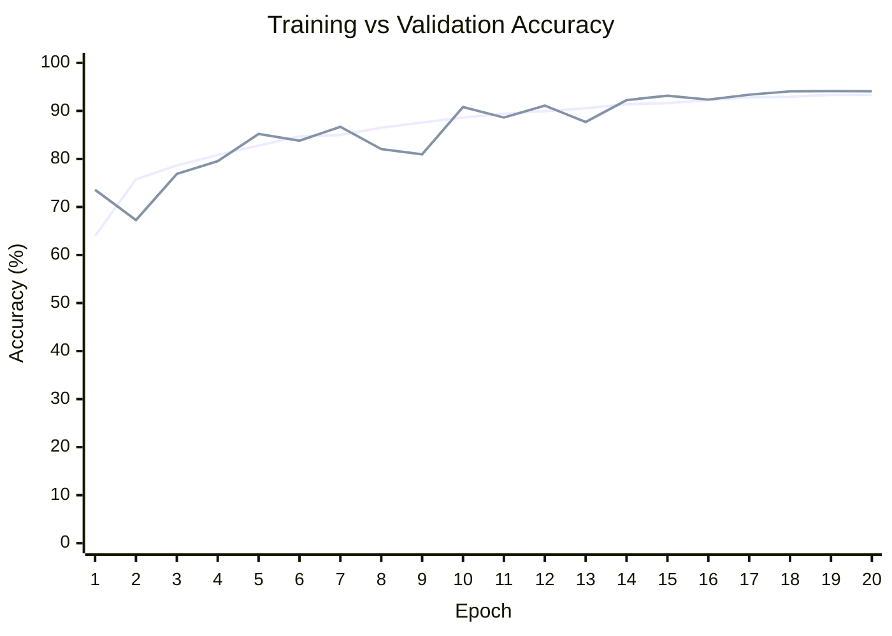
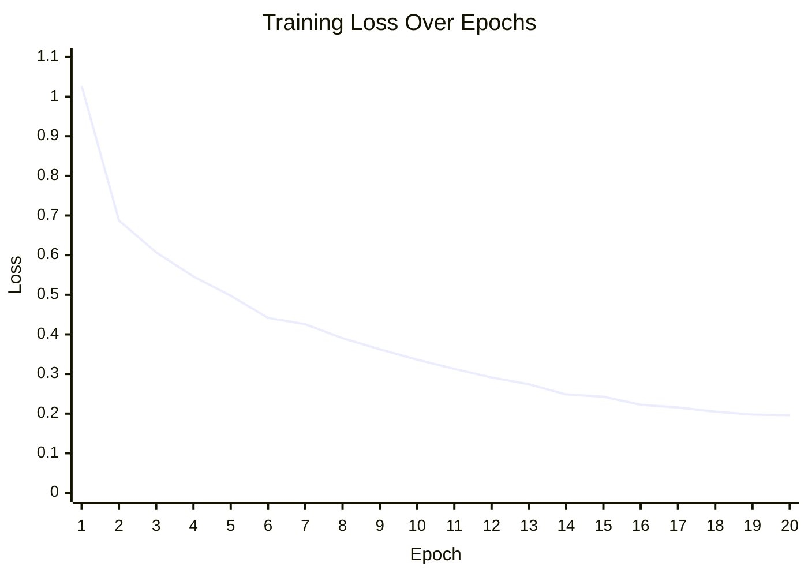

# Training Results

## Model Training Summary

**Training Configuration**

* Total Epochs: 20
* Best Validation Accuracy: **94.12%**
* Final Training Accuracy: **93.32%**
* Final Training Loss: **0.1959**
* Checkpoints Saved:

  * `best_model.pth`
  * `final_model_weights.pth`
  * `checkpoints/`

---

## Epoch Performance

| Epoch | Train Loss | Train Accuracy | Validation Accuracy | Time (s) |
| ----: | ---------: | -------------: | ------------------: | -------: |
|     1 |     1.0270 |         63.94% |              73.58% |     4.22 |
|     2 |     0.6874 |         75.76% |              67.26% |     2.55 |
|     3 |     0.6068 |         78.66% |              76.89% |     2.66 |
|     4 |     0.5460 |         80.83% |              79.53% |     2.55 |
|     5 |     0.4974 |         82.79% |              85.21% |     2.56 |
|     6 |     0.4417 |         84.70% |              83.80% |     2.65 |
|     7 |     0.4256 |         84.99% |              86.69% |     2.49 |
|     8 |     0.3902 |         86.51% |              82.05% |     2.48 |
|     9 |     0.3622 |         87.58% |              80.96% |     2.33 |
|    10 |     0.3363 |         88.62% |              90.81% |     2.47 |
|    11 |     0.3128 |         89.39% |              88.62% |     2.55 |
|    12 |     0.2912 |         89.96% |              91.11% |     2.59 |
|    13 |     0.2740 |         90.55% |              87.70% |     2.84 |
|    14 |     0.2484 |         91.37% |              92.25% |     2.56 |
|    15 |     0.2427 |         91.61% |              93.16% |     2.55 |
|    16 |     0.2224 |         92.25% |              92.35% |     2.67 |
|    17 |     0.2154 |         92.82% |              93.38% |     2.55 |
|    18 |     0.2048 |         92.93% |              94.07% |     2.58 |
|    19 |     0.1975 |         93.34% |              94.12% |     2.51 |
|    20 |     0.1959 |         93.32% |              94.10% |     2.52 |

---

# Training Visualization

## Accuracy Progression



## Loss Reduction



---

# Training Observations

## Convergence Behavior

* Training loss decreased consistently from **1.0270 → 0.1959**, showing stable optimization.
* Training accuracy improved from **63.94% → 93.32%**.
* Validation accuracy peaked at **94.12%**, indicating strong generalization.
* After epoch 10, validation accuracy consistently remained above **87%**, demonstrating model stability.
* Training time stabilized around **2.5 seconds per epoch** after the first epoch.

## Best Model

The best checkpoint was achieved at:

```
Epoch: 19
Validation Accuracy: 94.123%
Train Accuracy: 93.34%
Train Loss: 0.1975
```

Saved artifacts:

```
best_model.pth
final_model_weights.pth
checkpoints/
```


